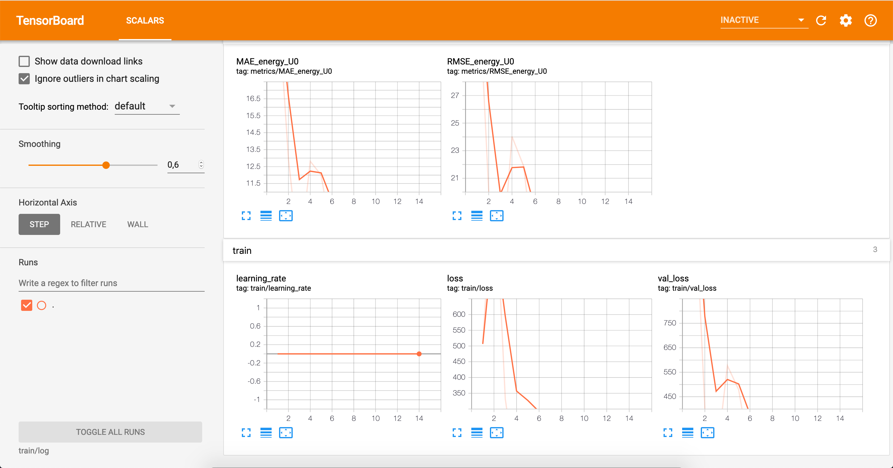

.. _tut etha:

Tutorial: Using SchNetPack with custom Data
===========================================

This tutorial will explain how to use SchNetPack for training a SchNet model
on custom datasets and how the trained model can be used for further
experiments. For this tutorial we will create a new folder. Therefore ``cd`` to your
desired location and create a new directory::

    mkdir schnet_tutorial
    cd schnet_tutorial

.. _tut etha prep:

Prepare the Data for Training
-----------------------------

This tutorial will use an ethanol dataset which can be downloaded
`here <http://quantum-machine.org/gdml/data/xyz/ethanol_dft.zip>`_. First of all you
will need to create a data directory in the tutorial folder. Therefore run::

    mkdir data

Move the downloaded dataset to the data folder and unzip it with::

    unzip data/ethanol_dft.zip

The dataset should be provided as an xyz-file. In order to use the dataset for
training you will need to use the parsing script. This will convert the xyz-file to
an ``ase.db`` which is suitable for SchNetPack. Run the script with::

    spk_parse.py with forces file_path=data/ethanol.xyz db_path=data/ethanol.db

You will end up with a new file in your data directory.

.. _tut etha train:

Train a Model on the Ethanol Database
-------------------------------------

This example trains a Schnet model on energy and forces of the previously
generated database of ethanol conformations.
Here we go through various sections of example script.

We start by importing modules used in the example::

    import os
    import logging
    from torch.optim import Adam
    import schnetpack as spk
    from schnetpack.train import Trainer, CSVHook, ReduceLROnPlateauHook
    from schnetpack.metrics import MeanAbsoluteError
    from schnetpack.metrics import mse_loss

and adjust the basic setting of the model as described below::

    # basic settings
    model_dir = "ethanol_model"  # directory that will be created for storing model
    properties = ["energy", "forces"]  # properties used for training

this is followed by making a directory to store the model::

    os.makedirs(model_dir)

Train, Validation & Test Sets
.............................

Then, we load the database and the required properties given as a list of strings
(which should match the name of properties used in database file)::

    dataset = spk.AtomsData("data/ethanol.db", required_properties=properties)

in the next step, the dataset is spli into train, validation and test sets. The
corresponding indices are stored in split.npz file::

    train, val, test = spk.train_test_split(
        data=dataset,
        num_train=1000,
        num_val=100,
        split_file=os.path.join(model_dir, "split.npz"),
    )

the datasets are then used to build the dataloaders. The dataloaders provide batches
of our dataset for the training session::

    train_loader = spk.AtomsLoader(train, batch_size=batch_size)
    val_loader = spk.AtomsLoader(val, batch_size=batch_size)

Model Representation
....................

The `Schnet` network is build for learning the representation by assigning the optional
argument `n_interactions`. To further customize the network see API Documentation::

    representation = spk.SchNet(n_interactions=6)

Model Network
.............

The ``Atomwise`` network is build for accumulating atom-wise property predictions::

    output_modules = [
        spk.Atomwise(
            property="energy",
            derivative="forces",
            mean=means["energy"],
            stddev=stddevs["energy"],
            negative_dr=True,
        )
    ]

The `model` is built by joining the representation network and output networks::

    model = spk.AtomisticModel(representation, output_modules)

Building the Optimizer
......................

In order to update model parameters we will need to build an optimizer::

    optimizer = Adam(params=model.parameters(), lr=1e-4)

Monitor Train Process: Hooks
............................

You can use `hooks` to monitor or control the progress of your training session. For
this tutorial we will use a ``CSVHook`` for monitoring and the ``ReduceLROnPlateauHook``
automatically reduces the learning rate if the training session does not improve any
further. To learn more about customizing hooks see API Documentation::

    metrics = [MeanAbsoluteError(p, p) for p in properties]
    hooks = [
        CSVHook(log_path=model_dir, metrics=metrics),
        ReduceLROnPlateauHook(optimizer)
    ]

Train Model
...........

Before, we train the model, the loss function is defined for the properties we are training on.
This loss function measures the discrepancy between batch predictions and actual results::

    loss = mse_loss(properties)

Now, the model can be trained for the given number of epochs on the specified device.
This will save the best_model as well as checkpoints in the model directory specified above.
To learn more about customizing trainer see the API Documentation::

    trainer = Trainer(
        model_dir,
        model=model,
        hooks=hooks,
        loss_fn=loss,
        optimizer=optimizer,
        train_loader=train_loader,
        validation_loader=val_loader,
    )
    trainer.train(device="cpu", n_epochs=1000)

.. _tut etha monitoring:

Monitoring your Training Session
--------------------------------

We recommend to use TensorBoard for monitoring your training session. Therefore
you will need to open add the ``TensorboardHook`` to the list of hooks::

    TensorboardHook(log_path=model_dir, metrics=metrics)

In order to use the TensorBoard you will need to install ``tensorflow`` in your
environment::

    pip install tensorflow

and ``cd`` to the directory of this tutorial. Make sure that your environment is
activated and run TensorBoard::

    tensorboard --logdir=ethanol_model

Your terminal will display a message which contains a URL to your board. Copy it into
your browser and the TensorBoard should show up:

|TensorBoard|

.. _tut etha eval:

Evaluating Datasets with a trained Model
----------------------------------------

When the training session has ended you can use the trained model to predict
properties for other datasets. You will find a small dataset with ethanol molecules here
xxrefxx. Download the snippet and store it in the data directory of your tutorial
folder. If you open the dataset you will notice that the molecules do not contain any
values for energy or forces. The missing properties will be predicted by using the
trained model::

    spk_eval.py with in_path=data/ethanol_missing.xyz out_path=data/ethanol_predicted.db model_dir=training_ethanol

The script will look inside the ``model_dir`` and find the best model of the training
session, which will automatically be used for the predictions. You will end up with a
new ``ase.db`` file in your data directory, which contains the energy values in the
*data* column.

.. _tut etha calc:

Using a trained Model as a Calculator for ASE
---------------------------------------------

The trained model can also be used as a calculator for ``ase``. For the purpose of
this tutorial we will write a small example script which reads a molecule from our
test snippet that has been downloaded in section :ref:`tut etha eval` and predict its
properties. Therefore we start with the necessary imports::

    import torch
    from ase.io import read
    from schnetpack.ase_interface import SpkCalculator

Secondly build an ``ase`` calculator from our model. Therefore you will need to load
the model and use the ``SpkCalculator`` class::

    # load model
    path_to_model = 'training_ethanol/best_model'
    model = torch.load(path_to_model)
    # build calculator
    calculator = SpkCalculator(model, device='cpu')

Afterwards you will need to load an ``ase.Atoms`` object from the database and set
the calculator::

    atoms = read('ethanol_missing.xyz')
    # set calculator
    atoms.set_calculator(calculator)

At last just print the result::

    print('energy', atoms.get_total_energy())
    print('forces', atoms.forces())

Execute the script and you should see the energy prediction.