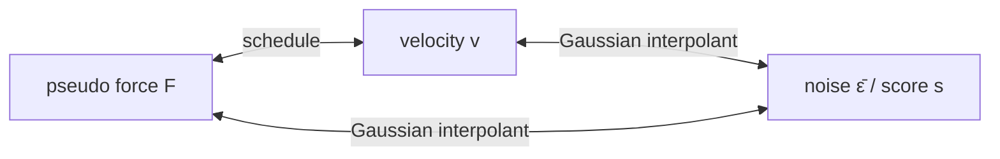

# Parametrizations

A parametrization fixes what the network predicts. The parametrizations form a **hierarchy** that follows the levels of noising: some only need pairs of noisy and clean structures, others need the schedule of an interpolant, and others need a Gaussian interpolant. The more a parametrization assumes, the more fields can be computed from it. This page introduces the hierarchy and then, for each parametrization, states what it requires and what can be computed from it. Notation follows the [[overview#Notation|overview]].

---

## 1 Training

A parametrization fixes a regression target $\phi^\star$, built from the clean structure $x_0$, the noisy structure $x_t$ and whatever else the parametrization needs. The network $\hat\phi(t,x_t)$ is trained with the loss

$$
\mathcal L=\mathbb E\,w(t)\,\big\lVert\hat\phi(t,x_t)-\phi^\star\big\rVert^2 ,
$$

and learns the **field** $\phi(t,x)=\mathbb E[\phi^\star\mid x_t=x]$. $w(t)\ge0$ is an optional loss weight. The magnitude of most targets changes strongly with the noise level, and $w$ normalizes it so that no noise level dominates the loss.

---

## 2 Hierarchy

Each parametrization has a minimum requirement on the noising used in training:

| Parametrization | Minimum noising requirement |
|---|---|
| Pseudo force | none |
| Velocity | [[noising#2 Interpolant\|interpolant]] |
| Noise, score | [[noising#3 Gaussian interpolant\|Gaussian interpolant]] |

The requirement only limits where a parametrization can be trained. Which fields, and with them which generation methods, are available is decided by the noising:

| Noising in training | Available fields | Generation |
|---|---|---|
| any noising process | $\eta_0$, $F$ | optimization |
| interpolant | $+\ v$ | $+$ ODE sampling |
| Gaussian interpolant | $+\ \bar\epsilon$, $s$ | $+$ SDE sampling |

Two rules follow:

- **Every parametrization gives all fields its noising allows.** A pseudo-force model trained on a Gaussian interpolant gives the velocity and the score too, and drives optimization, ODE and SDE sampling. The pseudo force is therefore the least restrictive choice: it can be trained on any noising and gives up nothing on a Gaussian interpolant.
- **Conversions use what the noising provides.** Pseudo force ↔ velocity uses the schedule $a$, $b$. Conversions to and from noise and score also use the Gaussian prior and its width $\sigma_{\max}$.

---

## 3 Pseudo force

| Target | Learned field | Requires |
|---|---|---|
| $x_0-\tilde x$ | $F(t,x)=\eta_0(t,x)-x$ | pairs $(x_0,\tilde x)$ |

The pseudo force is the displacement from the noisy structure to the clean one [1]. It is the force of the pseudo energy $U=\tfrac12\lVert x_0-\tilde x\rVert^2$, i.e. $-\nabla_{\tilde x}U=x_0-\tilde x$; the factor $\tfrac12$ makes the force equal to the displacement. Its target only needs a clean structure and a noisy copy of it, from any [[noising#1 Noising process|noising process]]. The process does not have to be known, and the network does not need a [[time|time input]].

**What can be computed.**

| Field          | Formula                           | Additionally requires | Breaks at    |
| -------------- | --------------------------------- | --------------------- | ------------ |
| $\eta_0$       | $x+F$                             | nothing               | never        |
| $v$            | $\dfrac{(\dot b-D)\,x-D\,F}{b}$   | schedule $a$, $b$     | $b\to0$      |
| $\bar\epsilon$ | $\dfrac{(1-a)\,x-a\,F}{\sigma}$   | Gaussian interpolant  | $\sigma\to0$ |
| $s$            | $\dfrac{(a-1)\,x+a\,F}{\sigma^2}$ | Gaussian interpolant  | $\sigma\to0$ |
todo: say that a, sigma, D are defined in interpolants

---

## 4 Velocity

| Target | Learned field | Requires |
|---|---|---|
| $\dot a\,x_0+\dot b\,x_1$ | $v(t,x)=\mathbb E[\dot x_t\mid x_t=x]$ | interpolant with schedule $a$, $b$ |

The velocity is the time derivative of the interpolant [2–4]. Its target needs both endpoints of every training pair and the schedule, but no assumption on the prior or the coupling.

**What can be computed.**

| Field | Formula | Additionally requires | Breaks at |
|---|---|---|---|
| $\eta_0$ | $\dfrac{\dot b\,x-b\,v}{D}$ | nothing | never |
| $F$ | $\dfrac{(\dot b-D)\,x-b\,v}{D}$ | nothing | never |
| $\bar\epsilon$ | $\dfrac{a\,v-\dot a\,x}{\sigma_{\max}D}$ | Gaussian interpolant | never |
| $s$ | $\dfrac{2\,(f\,x-v)}{g^2}$ | Gaussian interpolant | $\sigma\to0$ |

The conversion to the score uses the drift and diffusion coefficients of the Gaussian interpolant,

$$
f=\frac{\dot a}{a},\qquad g^2=\frac{2\,\sigma_{\max}\,\sigma\,D}{a}=\frac{d\sigma^2}{dt}-2f\sigma^2 .
$$
---

## 5 Noise

| Target | Learned field | Requires |
|---|---|---|
| $\epsilon=x_1/\sigma_{\max}$ | $\bar\epsilon(t,x)=\mathbb E[\epsilon\mid x_t=x]$ | Gaussian interpolant |

The noise is the unit Gaussian behind the prior sample [5]. On a Gaussian interpolant the conditional law is $\rho_t(x\mid x_0)=\mathcal N(a\,x_0,\sigma^2 I)$, so $\bar\epsilon$ is tied to the score by $s=-\bar\epsilon/\sigma$.

**What can be computed.**

| Field | Formula | Additionally requires | Breaks at |
|---|---|---|---|
| $s$ | $-\dfrac{\bar\epsilon}{\sigma}$ | nothing | $\sigma\to0$ |
| $\eta_0$ | $\dfrac{x-\sigma\,\bar\epsilon}{a}$ | nothing | $a\to0$ |
| $F$ | $\dfrac{(1-a)\,x-\sigma\,\bar\epsilon}{a}$ | nothing | $a\to0$ |
| $v$ | $\dfrac{\dot a\,x+\sigma_{\max}D\,\bar\epsilon}{a}$ | nothing | $a\to0$ |

---

## 6 Score

| Target | Learned field | Requires |
|---|---|---|
| $-\epsilon/\sigma$ | $s(t,x)=\nabla_x\log\rho_t(x)$ | Gaussian interpolant |

The target is the score of the Gaussian conditional law, $\nabla_x\log\mathcal N(x_t;\,a\,x_0,\sigma^2 I)=-\epsilon/\sigma$, and its conditional mean is the marginal score. This is denoising score matching [6, 7].

**What can be computed.**

| Field | Formula | Additionally requires | Breaks at |
|---|---|---|---|
| $\bar\epsilon$ | $-\sigma\,s$ | nothing | never |
| $\eta_0$ | $\dfrac{x+\sigma^2 s}{a}$ (Tweedie [8]) | nothing | $a\to0$ |
| $F$ | $\dfrac{(1-a)\,x+\sigma^2 s}{a}$ | nothing | $a\to0$ |
| $v$ | $f\,x-\tfrac12 g^2 s$ | nothing | $a\to0$ |

---

## 7 Loss weighting

On a Gaussian interpolant the conversions are affine at fixed $t$, so the error of each field is a fixed multiple of the noise error $\Delta\epsilon=\hat{\bar\epsilon}-\bar\epsilon$. The error sits inside the squared norm of the loss, while $w(t)$ sits outside, so the factor enters squared. Training a parametrization with $w\equiv1$ therefore equals the noise loss with the weight $w_\epsilon(t)$:

| Parametrization | Error | $w_\epsilon(t)$ |
|---|---|---|
| Noise | $\Delta\epsilon$ | $1$ |
| Score | $\Delta s=-\dfrac{\Delta\epsilon}{\sigma}$ | $\dfrac{1}{\sigma^2}$ |
| Pseudo force | $\Delta F=-\dfrac{\sigma}{a}\,\Delta\epsilon$ | $\dfrac{\sigma^2}{a^2}$ |
| Velocity | $\Delta v=\dfrac{\sigma_{\max}D}{a}\,\Delta\epsilon$ | $\dfrac{\sigma_{\max}^2D^2}{a^2}$ |

---

## References

1. Hessmann, Kahouli, Gugler, Plainer, Noé, Müller, Gebauer (2026). *Generative Pseudo-Force Fields for Molecular Generation.* arXiv:2605.19050.
2. Albergo, Boffi, Vanden-Eijnden (2023). *Stochastic Interpolants: A Unifying Framework for Flows and Diffusions.* arXiv:2303.08797.
3. Lipman, Chen, Ben-Hamu, Nickel, Le (2023). *Flow Matching for Generative Modeling.* ICLR. arXiv:2210.02747.
4. Liu, Gong, Liu (2023). *Flow Straight and Fast: Learning to Generate and Transfer Data with Rectified Flow.* ICLR. arXiv:2209.03003.
5. Ho, Jain, Abbeel (2020). *Denoising Diffusion Probabilistic Models.* NeurIPS. arXiv:2006.11239.
6. Vincent (2011). *A Connection Between Score Matching and Denoising Autoencoders.* Neural Computation 23(7), 1661–1674.
7. Song, Ermon (2019). *Generative Modeling by Estimating Gradients of the Data Distribution.* NeurIPS. arXiv:1907.05600.
8. Efron (2011). *Tweedie's Formula and Selection Bias.* JASA 106(496), 1602–1614.
9. Song, Sohl-Dickstein, Kingma, Kumar, Ermon, Poole (2021). *Score-Based Generative Modeling through Stochastic Differential Equations.* ICLR. arXiv:2011.13456.
